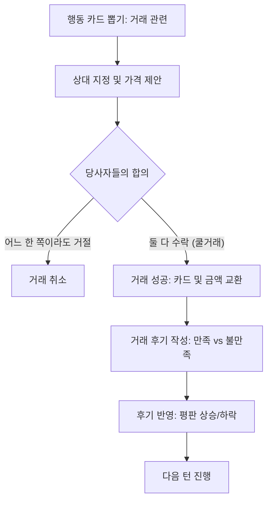

# 🤝 믿거래 (Midgeorae) 게임 시스템 분석 보고서

본 보고서는 중고거래 사기꾼(빌런)을 찾아내는 심리 추론 보드게임 **믿거래(Midgeorae)**의 핵심 메카닉, 게임 규칙, 재미 요소 및 로직 구조를 종합적으로 분석합니다.

---

## 1. 개요 및 핵심 컨셉

* **장르**: 심리 추론, 역할극, 보드게임, 경제 시뮬레이션
* **인원**: 3 ~ 4인용 (봇 테스트 모드 지원)
* **컨셉**: 평화로운 중고장터에 숨어든 사기꾼(빌런)과 자신의 비밀 미션을 완수하려는 시민들 간의 심리전. 거래 기록과 평판을 단서로 빌런을 색출하는 동시에, 개인의 경제적 승리를 쟁취해야 합니다.

---

## 2. 역할군 (Roles) & 승리 조건

게임 시작 시 모든 플레이어는 비공개로 시민 또는 빌런 역할을 부여받습니다.

### 👤 시민 (Citizen) 팀
시민들은 각자 직업에 맞는 **비밀 미션**을 완수하고, 동시에 **빌런을 검거**해야 승리합니다.

* **승리 조건**:
  1. 최종 투표(고발 단계)에서 **빌런을 과반수 득표로 검거**해야 합니다.
  2. 빌런 검거 성공 시, 자신의 직업 비밀 미션을 달성한 시민이 최종 단독 우승합니다. (달성자가 없거나 동점인 경우, 최종 총 자산과 평판 가치가 가장 높은 시민이 승리)
* **시민 직업 카드 종류**:
  * **개발자 (Developer)**: 보유한 모든 물건의 카테고리가 '전자제품'이어야 함 (최소 1개 이상).
  * **모델 (Model)**: 보유한 모든 물건의 카테고리가 '패션잡화'이어야 함 (최소 1개 이상).
  * **주부 (Housewife)**: 보유한 모든 물건의 카테고리가 '생활용품'이어야 함 (최소 1개 이상).
  * **벽돌 수집가 (Brick Collector)**: 가치가 없는 '벽돌 카드'를 4개 이상 보유해야 함.
  * **수집가 (Collector)**: 물건(벽돌 포함)을 8개 이상 보유해야 함.
  * **일반 시민 (General Citizen)**: 게임 종료 시 최종 총 자산이 250만 원 이상이어야 함.

### 🦹 빌런 (Villain)
빌런은 혼자서 시민들을 속이고 가치 없는 물건(벽돌 등)을 비싸게 팔아 사기를 쳐야 합니다.

* **승리 조건**:
  1. 최종 투표에서 **최다 득표 지목을 회피**해야 합니다.
  2. **[필수 사기 미션]**: 발각되지 않고 다른 플레이어에게 실제 가치보다 비싼 가격으로 사기 판매를 **2회 이상 성공**해야 합니다.
* **빌런 비밀 미션 (여론 교란)**:
  * "좋아요 토큰을 선물하며 다른 시민을 빌런처럼 보이게 만드세요."
  * "시민 한 명의 좋아요 토큰을 0개로 만들도록 여론을 유도하세요."
  * "거래 취소와 악평을 이용해 본인의 정체를 숨기세요."

---

## 3. 핵심 게임 메카닉 & 진행 흐름

### 🎲 1단계: 게임 준비 (Setup)
* 모든 플레이어는 역할(시민/빌런)과 직업 카드를 확인합니다.
* **기본 자산**: 시작 자금 1,000,000원과 무작위 물건 카드 5장을 비공개로 지급받습니다.
* **시장 행동 제한**: 인원에 비례하여 행동 예산이 주어집니다. (3인: 15회, 4인: 20회)
* **시작 플레이어**: 무작위로 1명이 선정되며, 턴 진행 방향은 **반시계방향(🔄)**입니다.

### 🔄 2단계: 턴 진행 단계 (Turn Play Loop)
자신의 차례가 된 플레이어는 아래 과정을 밟습니다:
1. **행동 카드 뽑기 (Draw Action Card)**: 공용 덱에서 행동 카드를 뽑아 전체 공개합니다.
2. **행동 실행 (Perform Action)**: 뽑은 카드에 적힌 행동을 지정하여 수행합니다. (거래 신청, 물물교환 등)
3. **턴 종료 및 다음 플레이어 이동**: 반시계방향으로 턴이 전환됩니다.

---

## 4. 거래 합의 및 평판 피드백 루프

믿거래의 핵심 재미는 거래 성공 후 작성하는 **상호 평가**에서 나옵니다.

### 🤝 1. 거래 합의 (Cool Trade vs Cancel)
* 거래 신청자가 가격을 제안하면, 상대방은 이를 보고 수락 여부를 정합니다.
* 양측 모두 **쿨거래(수락)**를 누르면 대금이 지급되고 카드가 이동합니다. 한 명이라도 **거래취소(거절)**하면 거래가 무산됩니다.

### ✍️ 2. 거래 후기 (Review) & 매너 평가
* 거래 성공 시 양 당사자는 **만족👍** 또는 **불만족👎** 평가를 비공개로 내립니다.
* **평판 토큰 (Reputation Tokens)**:
  * 만족👍을 받으면 좋아요가 늘어나고, 불만족👎을 받으면 악평이 늘어나며 평판 토큰이 차감될 수 있습니다.
  * **평판 고갈 패널티**: 평판(좋아요 토큰)이 0개가 되는 즉시 해당 플레이어는 파산/탈락하여 게임이 즉시 강제 종료됩니다.

---

## 5. 경제 및 카드 밸류 시스템

### 📦 물건 카드 (Item Cards)
물건은 4개 카테고리(`electronics`, `fashion`, `hobby`, `living`)로 분류됩니다.

* **등급 배율 (Condition Multipliers)**:
  * **미개봉 (Mint)**: 시세의 `80%` 가치로 총자산에 반영됩니다.
  * **사용감 있음 (Used)**: 시세의 `60%` 가치로 총자산에 반영됩니다.
  * **하자 있음 (Broken / Defective)**: 시세의 `40%` 가치로 총자산에 반영됩니다.
* **총 자산 계산 공식**:
  $$\text{총 자산} = \text{보유 현금} + \sum (\text{물건 시세} \times \text{등급 배율})$$

### 🧱 벽돌 카드 (Brick Cards - 위장 시스템)
* **빌런의 핵심 도구**: 소지하지 않은 관전자나 구매자 화면에는 **일반 카테고리의 정상 물품으로 완벽히 마스킹되어 위장**됩니다.
* **사기 메카닉**: 벽돌 카드는 최종 정산 시 가치가 **0원**입니다. 빌런은 시민에게 벽돌 카드를 진짜 물건인 것처럼 비싸게 팔아넘겨 사기를 쳐야 합니다.
* **사기 기준선 (Scam Threshold)**:
  * 아이템 등급 가치보다 단 1원이라도 높은 가격에 팔면 **사기 거래**로 누적됩니다.
  * 시스템은 판매자가 금액을 입력할 때 아래에 `⚠️ 주의하세요. X원 부터 사기 거래가 됩니다.`를 실시간 계산하여 알려줍니다.

---

## 6. 행동 카드 명세 (Action Cards)

| 카드명 | 액션 타입 | 설명 | 덱 포함 개수 |
| :--- | :--- | :--- | :--- |
| **구매 신청** | `tradeRequest` | 상대방의 카드 중 카테고리만 보고 구매를 제안합니다. | 3장 |
| **판매 신청** | `saleRequest` | 내 물건 카드 중 하나를 선택해 가격을 매겨 상대방에게 제안합니다. | 3장 |
| **무료 나눔** | `freeGive` | 내 물건 카드를 강제로 0원에 다른 플레이어에게 양도합니다. | 2장 |
| **직거래** | `directTrade` | 거래할 카드를 사전에 먼저 모두 공개하고 거래를 진행합니다. | 2장 |
| **악플 테러** | `badReview` | 지정한 플레이어의 좋아요 평판 토큰 1개를 즉시 파괴합니다. | 2장 |
| **분리수거** | `recycle` | 손패의 쓸모없는 벽돌 카드를 제거하고 새 카드를 1장 뽑습니다. | 1장 |
| **물물교환** | `swap` | 대상 플레이어와 서로의 손패 중 1장을 무작위로 교환합니다. | 1장 |

---

## 7. 믿거래 게임의 핵심 재미 요소 (Fun Factors)

1. **정보의 비대칭성 (Information Asymmetry)**:
   * 손패의 등급 및 벽돌 여부는 나만 알 수 있습니다. 상대가 파는 물건이 미개봉 명품인지, 고장난 벽돌인지 가격과 카테고리 힌트만으로 추리해야 합니다.
2. **이중 목표의 상충 (Conflict of Interest)**:
   * 시민들은 힘을 합쳐 빌런을 잡아야 하지만, 동시에 개인 비밀 미션(특정 카테고리 독점 등)을 달성해야 단독 우승하므로 끊임없이 거래를 시도해 다른 시민들과 경쟁해야 합니다. 이 빈틈을 빌런이 파고듭니다.
3. **여론 조작과 평판 정치 (Reputation Politics)**:
   * 악플 테러나 후기 만족도 조작을 통해 평판을 갉아먹거나 타인을 빌런으로 몰아세우는 심리 정치가 가능합니다.
