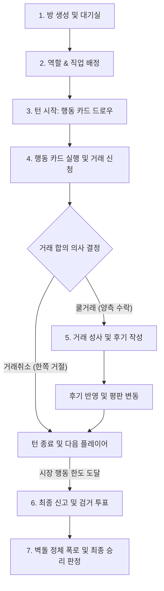

# 🤝 믿거래 (Midgeorae) 공식 게임 규칙서

본 문서는 중고거래 심리 추리 보드게임 **'믿거래'**의 공식 게임 규칙 및 시스템 사양을 정의합니다.

---

## 👥 1. 역할군 및 승리 조건

게임 시작 시 모든 플레이어는 비공개로 **시민** 또는 **빌런** 역할을 부여받습니다.

### 👥 시민 (Citizen)
*   **승리 조건**: 최종 신고 단계에서 과반수 득표로 **빌런을 검거**해야 합니다.
*   **우승자 판정**: 빌런 검거 성공 시, 빌런을 제외한 시민 중 **개인 직업 미션을 달성한 플레이어가 최종 단독 우승**합니다.
    *   미션 달성자가 없거나 동점인 경우, **최종 자산(소지금 + 보유 아이템 시세 총합) 및 평판 가치**가 가장 높은 시민이 우승합니다.
*   **시민 직업 종류**:
    | 직업명 | 조건 및 미션 내용 | 시작 소지금 |
    | :--- | :--- | :--- |
    | **개발자 (Developer)** | 보유한 물건 중 '전자기기(Electronics)' 카테고리가 **2개 이상**이어야 함 (다른 물품 동시 보유 가능). | 2,000,000원 (첫 손패 감가 차감 전) |
    | **모델 (Model)** | 보유한 물건 중 '패션잡화(Fashion)' 카테고리가 **2개 이상**이어야 함 (다른 물품 동시 보유 가능). | 2,000,000원 (첫 손패 감가 차감 전) |
    | **주부 (Housewife)** | 보유한 물건 중 '생활용품(Living)' 카테고리가 **2개 이상**이어야 함 (다른 물품 동시 보유 가능). | 2,000,000원 (첫 손패 감가 차감 전) |
    | **벽돌 수집가 (Brick Collector)** | 게임 종료 시 '벽돌 카드'를 2개 이상 보유해야 함. (※ 특별 승리 규칙 적용) | 2,000,000원 (첫 손패 감가 차감 전) |
    | **수집가 (Collector)** | 게임 종료 시 물건 카드(벽돌 포함)를 8개 이상 보유해야 함. | 2,000,000원 (첫 손패 감가 차감 전) |
    | **일반 시민 (General Citizen)** | 최종 점수 계산 시 총 자산이 2,500,000원 이상이어야 함. | 2,000,000원 (첫 손패 감가 차감 전) |

> [!TIP]
> **🧱 벽돌 수집가 특별 승리 규칙 (Brick Collector Special Victory)**
> 벽돌 수집가가 벽돌 2개를 모두 수집하는 데 성공하면, 빌런 검거 투표 결과나 빌런의 사기 거래 성공 횟수 등 다른 모든 조건을 무시하고 **즉시 시민 팀 승리 및 벽돌 수집가의 최종 단독 우승**이 됩니다.

### 🦹 빌런 (Villain)
*   **승리 조건**: 최종 신고 단계에서 시민들의 투표를 피해 **검거를 피하고**, 동시에 **자신의 사기 미션(벽돌 판매 2회 성공)을 달성**해야 합니다.
*   **우승자 판정**: 빌런 검거 실패 및 미션 성공 시 빌런이 단독 우승합니다.
*   **빌런 미션 종류**:
    *   **벽돌 거래**: 판매자로서 '벽돌 카드' 판매(쿨거래 성사)를 2회 이상 성공시킬 것.

---

### 🃏 시작 손패 분배 및 역할 배정
*   **빌런 (Villain)**: **벽돌 카드 2장 + 일반 물건 카드 3장** (총 5장)을 비공개로 쥐고 시작합니다.
*   **시민 (Citizen)**: **일반 물건 카드 5장**을 비공개로 쥐고 시작합니다.
*   *주의*: 시민들의 화면에는 빌런의 벽돌 카드가 일반 물건으로 위장되어 보이기 때문에 겉보기에는 모두가 일반 물품 5장씩 가진 것으로 보입니다.

---

## 📈 2. 기초 스탯 및 자원

*   **시작 평판 토큰 및 조기 종료**:
    *   모든 플레이어는 **3개**의 평판 토큰을 소지하고 시작합니다. (최대 5개 보유 가능)
    *   평판 토큰이 **0개**가 되는 플레이어가 나오는 즉시 게임이 조기 종료되며 다음과 같이 승패가 결정됩니다:
        *   **빌런의 평판이 0개가 됨** ➡️ **시민 팀 즉시 승리** (시민 중 개인 직업 미션 달성자가 단독 우승)
        *   **시민의 평판이 0개가 됨** ➡️ **빌런 즉시 승리** (빌런 단독 우승)
*   **거래 만족도 평가**: 쿨거래 완료 후 서로에 대해 비공개 후기를 작성하며, 그 결과는 평판에 즉시 반영됩니다.
    *   **만족👍**: 상대방의 평판 토큰 +1 (최대 5개)
    *   **불만족👎**: 상대방의 평판 토큰 -1 (최소 0개)
*   **물건 상태에 따른 감가 배율**:
    *   모든 물건 카드는 무작위 상태(Condition)를 부여받으며, 상태에 따라 자산 가치(감가 가치)가 다르게 책정됩니다.
    *   🟢 **미개봉 새상품 (unopened)**: 정가(시세)의 **95%** 가치 반영 (`0.95`)
    *   🟡 **민트급 (mint)**: 정가(시세)의 **80%** 가치 반영 (`0.8`)
    *   🟠 **사용감 있음 (used)**: 정가(시세)의 **60%** 가치 반영 (`0.6`)
    *   🔴 **하자 있음 (defective / broken)**: 정가(시세)의 **40%** 가치 반영 (`0.4`)
*   **시작 소지금 계산 공식**:
    *   모든 직업의 기본 시작 자산은 2,000,000원입니다.
    *   게임 시작 시 나눠 받은 첫 손패 5장 카드의 감가 적용 가치(`handAssetValue`)를 구한 후, 기본 시작 자산에서 이를 차감한 금액이 시작 소지금이 됩니다.
    *   계산식: `Math.max(300,000원, 2,000,000원 - handAssetValue)` (현금 소지금은 최소 30만 원 보장)

---

## 🧱 3. 벽돌 위장 및 거래 규칙 (핵심 메카닉)

> [!IMPORTANT]
> **1. 항상 모든 물건 정보 공개 (Always Face-Up)**
> *   기존의 대기실 옵션이었던 '물건 공개 설정'이 완전히 폐지되었습니다.
> *   테이블에 깔린 모든 플레이어의 보유 물건 카드는 **항상 앞면이 보이도록(Face-up) 고정**됩니다.
> *   시민들은 다른 플레이어가 어떤 카드를 가지고 있는지 투명하게 확인할 수 있으나, 아래의 '벽돌 위장' 규칙 때문에 겉모습만으로 진짜를 판별할 수는 없습니다.

> [!IMPORTANT]
> **2. 빌런(판매자)조차 모르는 벽돌의 위장 정체 (Blind Disguise)**
> *   **구매자 및 관전자 시점**: 벽돌 카드는 소유자가 아닌 다른 모든 플레이어에게 정상 물건(예: 120만 원짜리 아이폰, 15만 원짜리 스니커즈 등)으로 감쪽같이 위장되어 보입니다.
> *   **소유자(빌런/판매자) 시점**: 본인의 화면에는 이 카드가 **[벽돌]**이라는 사실만 표시될 뿐, 상대방에게 어떤 물품으로 위장되어 보여지는지는 전혀 알 수 없습니다.
> *   *기획의 묘미*: 빌런이 벽돌을 처분하기 위해 80만 원에 판매 제안을 보냈으나, 해당 벽돌이 상대방에게 15만 원짜리 '스니커즈'로 위장되어 보인다면 상대방은 이상함을 감지하고 거래를 거절하거나 불만족 후기를 남길 것입니다. 반대로 120만 원짜리 '아이폰'으로 위장되어 있다면 횡재라고 생각해 즉시 수락할 것입니다.

> [!IMPORTANT]
> **3. 게임 중 위장 가치 유지 ➡️ 최종 라운드에 가치 0원 폭로**
> *   **게임 진행 중**: 벽돌을 구매한 시민은 그것이 벽돌인지 알 수 없으므로, 게임 도중에는 해당 위장 물건의 가치(미개봉/사용감 등에 따른 감가 가치)가 본인의 총자산에 그대로 합산되어 표시됩니다.
> *   **최종 라운드(신고 단계 이후)**: 게임이 완전히 마감되면 유통되었던 모든 벽돌 카드가 일제히 정체를 드러냅니다. 벽돌 카드의 가치는 **0원**으로 정산되며, 벽돌을 고가에 샀던 시민들은 자산 계산에서 큰 타격을 입게 됩니다.

> [!IMPORTANT]
> **4. 사기 거래의 단순화**
> *   사기 거래는 시세 대비 판매가 격차가 아닌 **"빌런이 벽돌 카드를 상대방에게 판매(쿨거래 성사)했는가"**로 단순하게 정의됩니다. 가격과 관계없이 벽돌 카드가 거래 완료되면 즉시 사기 거래 1회로 누적됩니다.

> [!IMPORTANT]
> **5. 매 라운드(사이클) 종료 시 사기 발생 여부 전체 공개 (Quest Result)**
> *   모든 플레이어가 턴을 한 번씩 마치는 1사이클(라운드)이 끝날 때마다, **해당 사이클 동안 빌런의 사기 거래(벽돌 판매 성공)가 발생했는지 여부(또는 누적 사기 성공 횟수)**가 전체 플레이어 공개 로그에 공지됩니다.
> *   시민들은 라운드 로그를 바탕으로 "이번 라운드에 거래를 성사시킨 인물들 중에 빌런이 있겠구나!" 하며 수사망을 좁혀나갈 수 있습니다.

---

## 🔄 4. 게임 진행 단계

### 1단계: 방 생성 및 대기실 (Lobby)
*   호스트가 방을 개설하고 플레이어가 참여합니다. (최소 3인 ~ 최대 4인)
*   모든 물건 카드는 **항상 공개(Face-up)** 옵션이 강제 적용됩니다.

### 2단계: 역할 & 직업 배정
*   각 플레이어는 역할(시민/빌런), 비밀 직업, 개인 미션을 부여받고 게임에 진입합니다.

### 3단계: 시장 거래 단계 (Market Phase)
*   전체 플레이어 수에 비례한 **시장 행동 예산(행동 한도)**이 설정됩니다 (3인: 15회, 4인: 20회).
*   플레이어는 턴이 돌아오면 **행동 카드**를 드로우한 후 지정된 액션을 수행합니다.

### 4단계: 행동 카드 상세 명세
모든 행동 카드는 아래의 가중치 비율에 의해 매 턴 확률적으로 무작위 드로우됩니다.

| 카드명 | 액션 타입 | 설명 | 출현 가중치 |
| :--- | :--- | :--- | :--- |
| **구매 신청** | `tradeRequest` | 상대방의 패에 있는 물건 카드 중 하나를 선택해 가격을 제안하고 구매를 시도합니다. | 3 (20.0%) |
| **판매 신청** | `saleRequest` | 내 손패의 물건 카드 중 하나를 선택하여 가격을 매겨 상대방에게 제안합니다. | 3 (20.0%) |
| **무료 나눔** | `freeGive` | 내 손패의 물건 중 하나를 상대방에게 0원에 강제 양도하여 상대방 덱에 선물합니다. (거절 불가) | 2 (13.3%) |
| **직거래** | `directTrade` | 거래할 카드를 미리 상호 공개한 뒤 협상 테이블을 엽니다. | 2 (13.3%) |
| **악플 테러** | `badReview` | 지목한 플레이어의 평판 토큰 1개를 즉시 파괴합니다. | 2 (13.3%) |
| **기부천사** | `donation` | 이웃 중 1명을 지목해 그들의 손패 중 무작위 물품 1장을 일방적으로 기부(강탈)받아 옵니다. | 1 (6.7%) |
| **물물교환** | `swap` | 대상 플레이어와 무작위로 카드를 한 장씩 맞교환합니다. | 1 (6.7%) |
| **자가 수리** | `repair` | 내 손패의 물건 중 원하는 카드 1장을 '미개봉' 상태로 업그레이드합니다. | 1 (6.7%) |

### 5단계: 거래 결정 및 후기 작성
*   거래가 시작되면 양측 플레이어는 가격 제안을 조율한 뒤 **쿨거래(수락)** 또는 **거래취소(취소)**를 선택합니다.
*   양측이 모두 수락하여 거래가 성사되면 즉시 **만족👍 / 불만족👎** 평가를 비공개로 내립니다.

### 6단계: 최종 신고 및 검거 투표 (Report Phase)
*   시장 행동 예산이 전부 소진되면 최종 신고 단계로 전환됩니다.
*   플레이어들은 토론을 거쳐 빌런으로 의심되는 1인을 투표로 검거합니다.

### 7단계: 승리 판정 및 결과 공개 (Result Phase)
*   투표 결과 빌런이 과반수 득표로 잡혔는지 여부를 판정합니다.
*   동시에 유통되던 모든 벽돌 카드가 일제히 0원으로 변하며 최종 자산 계산 및 미션 달성 여부를 정산하여 우승자를 가립니다.
