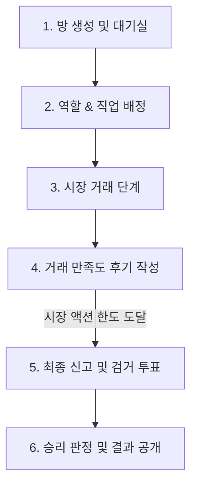

# 믿거래 게임 규칙서 (Game Rules)

이 문서는 중고거래 심리 추리 보드게임 **'믿거래'**의 전체적인 게임 규칙과 시스템을 설명합니다.

---

## 1. 게임 개요
*   **게임 인원**: 3 ~ 5인 (기본 4인 추천)
*   **게임 장르**: 중고거래 + 역할 수행 + 마피아 심리 추리
*   **기본 설정**:
    *   모든 플레이어는 중고거래 시장에서 물건을 거래하여 자산을 늘립니다.
    *   플레이어 중 1명은 사기 거래를 일삼는 **'빌런'**으로 지정되며, 나머지 플레이어는 **'시민'**이 됩니다.

---

## 2. 역할 (Roles) 및 승리 조건

### 👥 시민 (Citizens)
*   **승리 조건**: 최종 신고 단계에서 다수결 투표로 **빌런을 검거**하는 데 성공해야 합니다.
*   **우승자 판정**: 빌런 검거 성공 시, 빌런을 제외한 시민 중 **최종 자산(소지금 + 보유 아이템 시세 총합)**이 가장 많은 시민이 단독 우승합니다.
*   **행동 동기**: 시민에게는 개인 직업 미션이 주어지며, 이를 달성해야 보너스 자산(또는 토큰)을 얻어 우승 확률을 높일 수 있습니다.

### 😈 빌런 (Villain)
*   **승리 조건**: 최종 신고 단계에서 시민들에게 **검거되지 않거나**, 검거되더라도 **자신의 빌런 미션을 성공**하고 최종 생존해야 합니다.
*   **우승자 판정**: 빌런 검거 실패 및 미션 성공 시 빌런이 단독 우승합니다.

---

## 3. 기초 스탯 및 자원

| 스탯/자원 | 기본값 | 설명 |
| :--- | :--- | :--- |
| **시작 소지금** | 500,000원 | 직업에 따라 900,000원 ~ 1,100,000원으로 변동될 수 있습니다. |
| **평판 토큰** | 5개 | 플레이어의 생명력 역할을 하며, 0개가 되면 시장에서 중도 퇴출당합니다. |
| **매너 온도** | 36.5°C | 거래 평가 결과에 따라 상승 또는 하락합니다. |

### 📈 매너 온도 및 평판 변동 법칙
매 거래가 끝난 후 양측 플레이어는 서로에게 후기(평가)를 남깁니다.
*   **좋아요 (만족)**: 상대방의 평판 토큰 +1, 매너 온도 +0.5°C (최대 42.0°C)
*   **싫어요 (불만족)**: 상대방의 평판 토큰 -1, 매너 온도 -0.5°C (최소 30.0°C)
*   **매너 온도 패널티 & 보너스**:
    *   **35.0°C 이하**: 판매 등록 시 제한이 발생할 수 있습니다.
    *   **33.0°C 이하**: 평판 퇴출 경고 단계에 직면하거나 벌금이 부과될 수 있습니다.
    *   **38.0°C 이상**: 최종 점수 계산 시 매너 온도 보너스 혜택을 받습니다.

---

## 4. 시민 직업 및 빌런 미션

### 🎖️ 시민 직업 (Job Cards)
시민은 게임 시작 시 3가지 중 하나의 직업과 미션을 받습니다.

1.  **검수자 (Inspector)**
    *   *시작 소지금*: 900,000원
    *   *능력*: 진행 중인 거래 물품의 숨겨진 정보(상태, 하자, 위장, 벽돌 여부)를 감정 토큰을 소모하여 본인만 확인합니다.
    *   *미션*: 다른 플레이어와 2회 거래 시도.
2.  **흥정가 (Negotiator)**
    *   *시작 소지금*: 1,000,000원
    *   *능력*: 가격 조정을 더 유연하게 제안하고 흥정 혜택을 받습니다.
    *   *미션*: 시세와 다른 가격의 구매 신청을 2회 전송.
3.  **신고자 (Reporter)**
    *   *시작 소지금*: 1,100,000원
    *   *능력*: 상대방의 행동을 면밀히 분석하고 후기 등록에서 강점을 가집니다.
    *   *미션*: 거래 만족도 후기(좋아요/싫어요) 2회 이상 작성.

### 😈 빌런 미션 (Villain Missions)
빌런은 게임 시작 시 무작위로 아래의 미션 중 하나를 배정받습니다.

*   **벽돌 거래 (VILLAIN_MISSION_BRICK)**: 판매자로서 '벽돌 카드'가 포함된 사기 거래를 1회 이상 성공시킬 것.
*   **하자 판매 (VILLAIN_MISSION_DEFECT)**: 하자가 있는 물품(결함/파손)을 시세 이상의 가격으로 판매 완료할 것.
*   **폭리 거래 (VILLAIN_MISSION_OVERPRICE)**: 물품 시세 대비 110% 이상의 가격으로 2회 이상 판매 완료할 것.

---

## 5. 게임 진행 단계

### 1단계: 방 생성 및 대기실 (Lobby)
*   호스트가 방을 만들고, 생성된 초대 링크나 QR코드를 통해 플레이어들이 각자의 브라우저로 참여합니다.
*   최소 3명 ~ 최대 5명이 모이면 게임을 시작할 수 있습니다.

### 2단계: 역할 & 직업 배정
*   각 플레이어는 자신의 화면에서만 역할(시민/빌런), 직업, 소지금, 개인 미션을 비밀리에 확인합니다.

### 3단계: 시장 거래 단계 (Market Phase)
*   플레이어당 **5회의 시장 액션**을 수행할 수 있습니다.
*   시장에 자신의 아이템 카드를 판매 등록하거나, 등록된 매물에 구매 신청을 보냅니다.
*   구매 신청 시 **네고(흥정) 제안**을 할 수 있으며, 물품 ID에 따라 0.7 ~ 1.3배 범위 내에서 가격 조율이 이루어집니다.
*   거래가 성사되면 아이템 카드가 이동하고 구매 가격이 정산됩니다. 단, 사기 거래의 경우 장부상에는 정가로 위장되어 보일 수 있습니다.

### 4단계: 거래 만족도 후기 작성
*   거래 직후 서로에 대해 '좋아요' 또는 '싫어요' 평가를 남깁니다. 이에 따라 평판 토큰과 매너 온도가 변동됩니다.

### 5단계: 최종 신고 및 검거 투표 (Report Phase)
*   모든 플레이어의 시장 액션 횟수가 소진되면 최종 신고 단계로 전환됩니다.
*   토론을 거쳐 가장 의심스러운 플레이어(빌런 후보) 한 명을 비밀 투표로 지목합니다.

### 6단계: 승리 판정 및 결과 공개 (Result Phase)
*   가장 표를 많이 받은 플레이어가 실제 빌런인지 확인합니다.
*   빌런 검거 여부 및 미션 달성 여부에 따라 최종 승리 진영을 결정하고, 개인 자산을 정산하여 최종 순위를 표시합니다.
